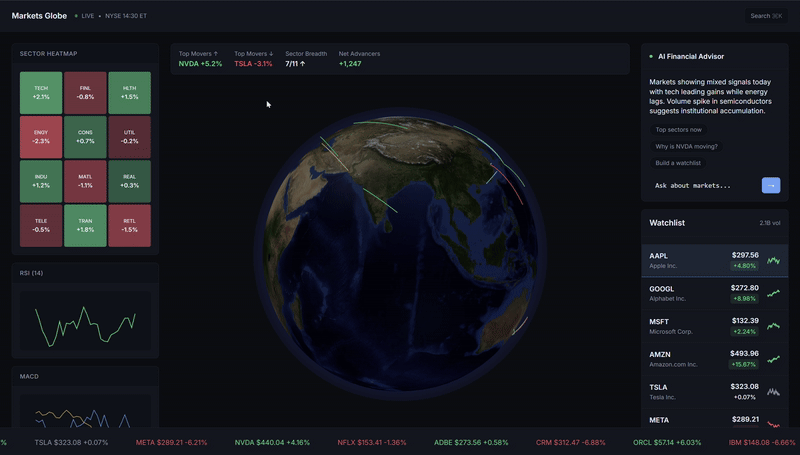

# Markets Globe – AI at the Edge  

  

  

Financial dashboards overwhelm users with raw numbers. Traders, analysts, and even casual investors spend valuable time interpreting data instead of acting on insights.  

**Markets Globe** solves this by turning real-time market feeds into **context-aware explanations** with memory and a conversational interface — so users get **the “why” behind the moves** instantly.  

This has a direct business impact:  
- **Faster decisions** → Instant AI summaries instead of manual analysis  
- **More accessible insights** → Complex data explained in plain English  
- **Higher engagement** → Conversational UX keeps users interacting longer  
- **Scalable edge deployment** → Low latency for a global audience  

The project meets all requirements: **AI, workflow/coordination, chat/voice UX, and Durable Object memory/state** — all on Cloudflare's edge.  

## 🌍 What You See  

- **AI Financial Advisor** → Explains market moves in plain English  
- **Sector Heatmaps + Watchlists** → Visualize trends instantly  
- **Session Memory** → Remembers context for multi-step questions  
- **Voice + Chat** → Works in both modes seamlessly  

---

## 🚀 How to Use  

1. Open the demo  
2. Ask: *“Why is NVDA up?”* → Get real-time, context-aware insights  
3. Follow up → Session memory keeps the conversation flowing  
4. Try voice mode for even quicker answers  

---

## 🧩 Under the Hood  

- **AI** → Llama 3.3 on Workers AI  
- **Coordination** → Workers orchestrate APIs, AI, and memory  
- **Memory** → Durable Objects store session history per user  
- **UI** → Edge-rendered, interactive globe + analytics dashboard  

---

Markets Globe turns a static dashboard into a **real-time, AI-powered market analyst** — making financial insights faster, clearer, and more accessible.  
